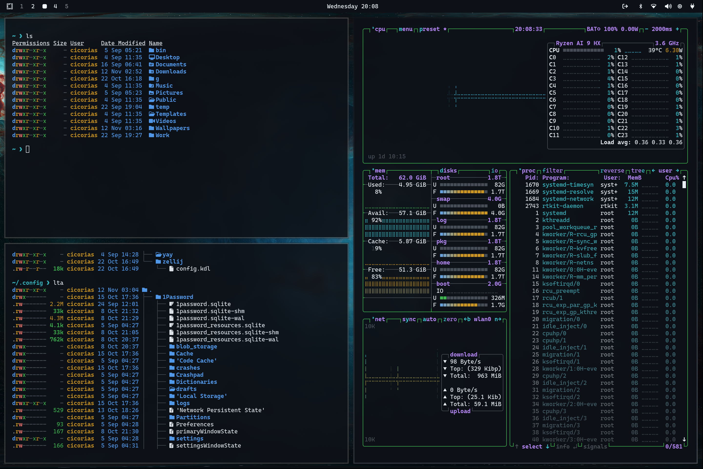

# Stellar Theme for Omarchy

Checkout [https://omarchy.org/](https://omarchy.org/) and [Omarchy Themes](https://learn.omacom.io/2/the-omarchy-manual/52/themes)

Install the theme by copying the GitHub URL  and selecting `Install > Style > Theme` via the Omarchy menu (`Super + Alt + Space`).

If you want to remove it again, just use `Remove > Style > Theme` and select it there.

This will show up as `Stellar`..

## Preview

## Background

